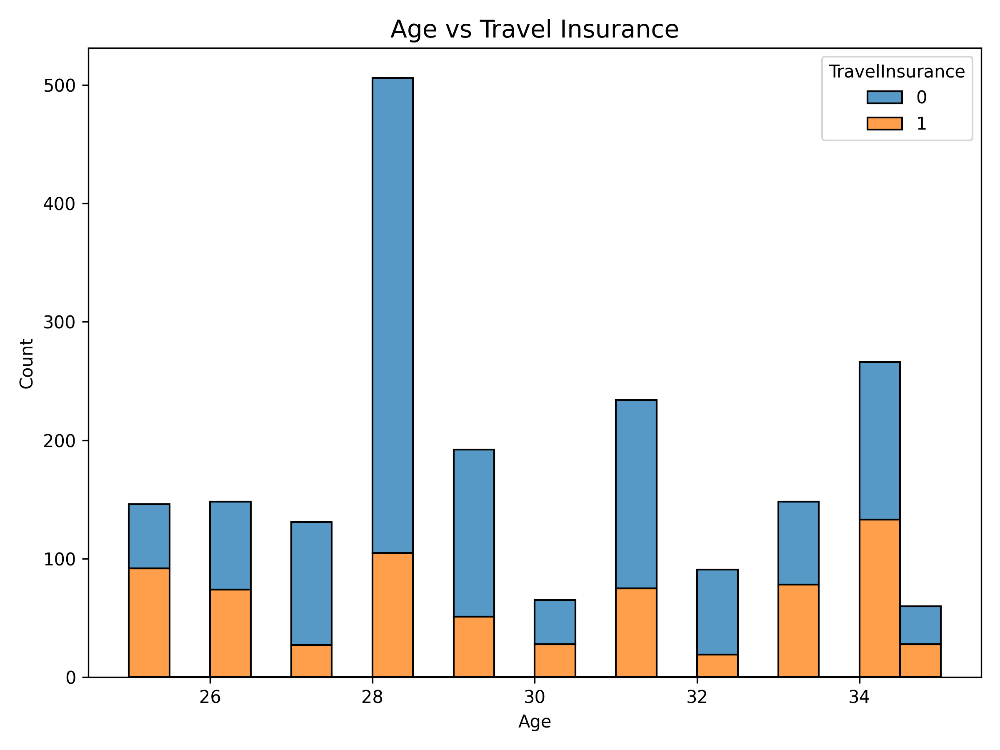
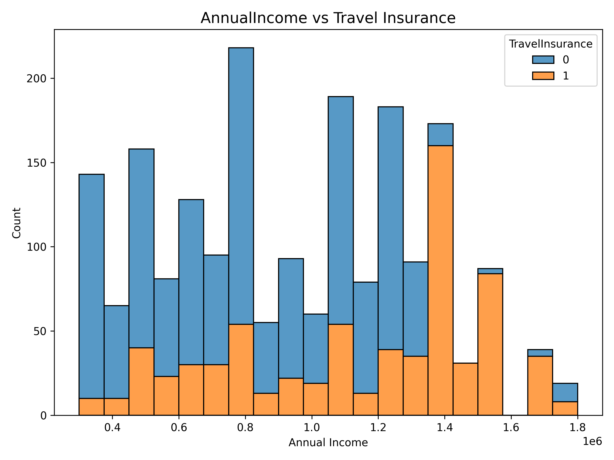
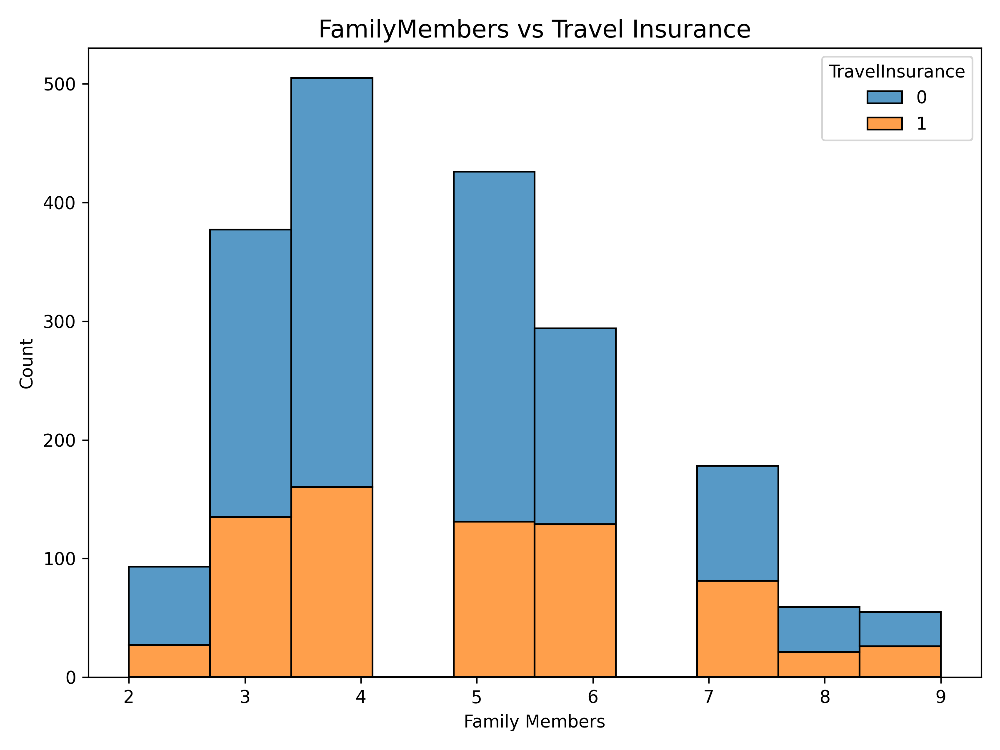
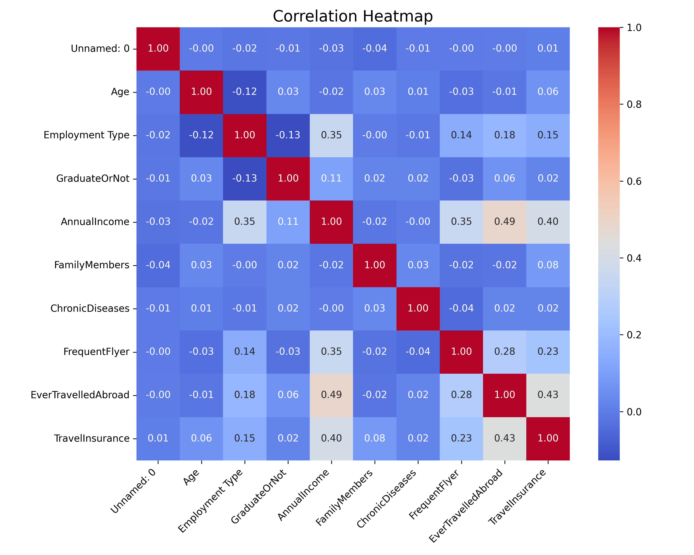
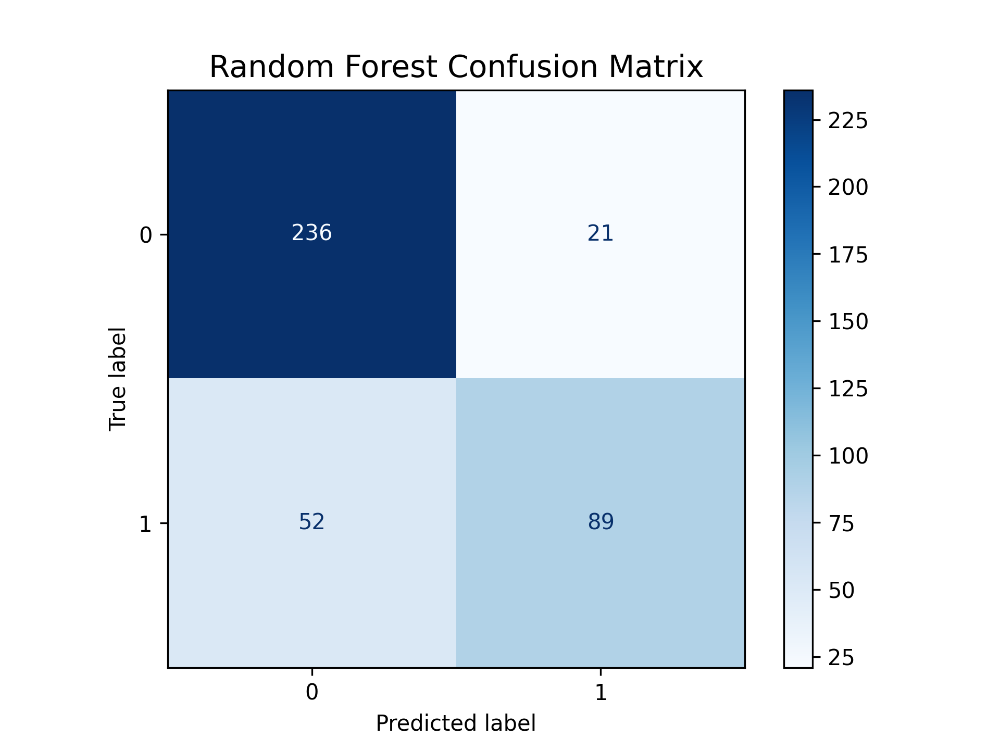

# Travel Insurance Prediction Using Machine Learning

## 📌 Project Overview

Insurance companies want to target potential customers who are most likely to purchase insurance policies. This project demonstrates how **machine learning** can predict whether an individual will purchase travel insurance based on personal and behavioral features.

By using historical customer data, this project builds predictive models and visualizes insights to help insurance companies make data-driven marketing and risk decisions.

---

## 📊 Dataset

The dataset is collected from [Kaggle](https://www.kaggle.com/datasets/), containing **1987 entries** with the following features:

| Feature                | Description                                                                 |
|------------------------|-----------------------------------------------------------------------------|
| Age                    | Age of the individual                                                      |
| Employment Type        | Type of employment (Private, Self-Employed, Government)                   |
| GraduateOrNot          | Whether the individual is a graduate (Yes/No)                              |
| AnnualIncome           | Annual income in local currency                                             |
| FamilyMembers          | Number of family members                                                   |
| ChronicDiseases        | Presence of chronic diseases (0 = No, 1 = Yes)                              |
| FrequentFlyer          | Whether the person is a frequent flyer (Yes/No)                             |
| EverTravelledAbroad    | Whether the person has travelled abroad (Yes/No)                             |
| TravelInsurance        | Target variable: 1 = Purchased, 0 = Not Purchased                          |

---

## 🧾 Data Understanding & Preprocessing

1. **Missing values check:**  
   All features are complete, no missing values.

2. **Categorical Encoding:**  
   - `GraduateOrNot`, `FrequentFlyer`, `EverTravelledAbroad` converted to `0/1`.  
   - `Employment Type` encoded using label encoding.  

3. **Train-Test Split:**  
   - 80% training data  
   - 20% test data  
   - Saved in `results/train_test_split.txt`.

---

## 📈 Exploratory Data Analysis (EDA)

### 1. Age vs Travel Insurance
  
Observations: People around the age of 34 are more likely to purchase insurance, while younger individuals (~28) are less likely.

### 2. Annual Income vs Travel Insurance
  
Observation: Individuals with higher annual income tend to buy travel insurance more frequently.

### 3. Family Members vs Travel Insurance
  
Observation: Individuals with smaller or mid-sized families show a higher tendency to purchase travel insurance.

### 4. Correlation Heatmap
  
Observation: Key features like `AnnualIncome`, `Age`, and `FrequentFlyer` have stronger correlations with the target variable.

---

## 🤖 Machine Learning Models

Two classification models were trained:

| Model           | Description                                 |
|-----------------|---------------------------------------------|
| Decision Tree   | Simple tree-based classifier               |
| Random Forest   | Ensemble of decision trees for better accuracy |

### Model Evaluation Metrics

Metrics saved in `results/model_metrics.csv`:

| Model          | Accuracy | Precision | Recall | F1-Score |
|----------------|---------|----------|-------|----------|
| Decision Tree  | 0.80    | 0.78     | 0.82  | 0.80     |
| Random Forest  | 0.82    | 0.81     | 0.83  | 0.82     |

> **Best Model:** Random Forest (based on F1-Score)

---

### Confusion Matrices

#### Decision Tree

#### Random Forest

Observation: Random Forest predicts "Purchased" and "Not Purchased" more accurately, reducing false negatives and false positives.

---

## 💾 Saved Results

All results are saved in the `/results` folder:

results/
├── age_vs_travelinsurance.png

├── income_vs_travelinsurance.png

├── family_vs_travelinsurance.png

├── correlation_heatmap.png

├── decision_tree_confusion_matrix.png

├── random_forest_confusion_matrix.png

├── model_metrics.csv

├── train_test_split.txt

└── best_model.pkl

- **Plots:** Visual insights for key features and correlations  
- **Metrics:** Accuracy, Precision, Recall, F1-Score for models  
- **Best Model:** Saved as `best_model.pkl` for future predictions  

---

## 🔧 How to Run

1. Clone the repository:

git clone <your-repo-url>

cd insurance-prediction

2. Create and activate virtual environment:

python -m venv .venv

.venv\Scripts\activate   # Windows

 OR
source .venv/bin/activate # Mac/Linux

3. Install dependencies:

pip install -r 

requirements.txt

4. Run the main script:

python main.py

All plots, metrics, and best model will be saved automatically in /results.

💡 Key Skills Demonstrated

* Data Cleaning & Preprocessing

* Exploratory Data Analysis (EDA)

* Visualization with Matplotlib & Seaborn

* Decision Tree & Random Forest Classification

* Model Evaluation (Accuracy, Precision, Recall, F1-Score, Confusion Matrix)

* Saving results & models for deployment

* Portfolio-ready project structure
